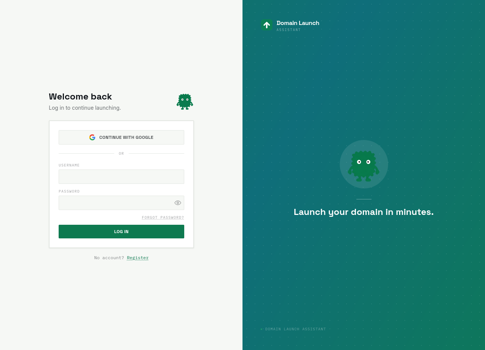
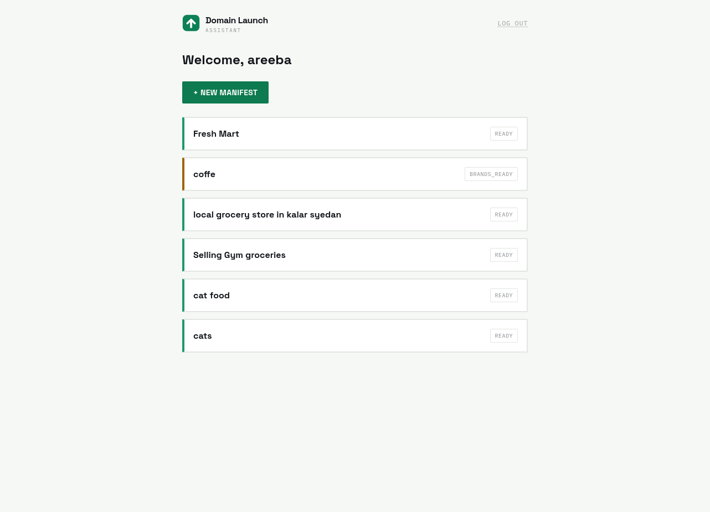
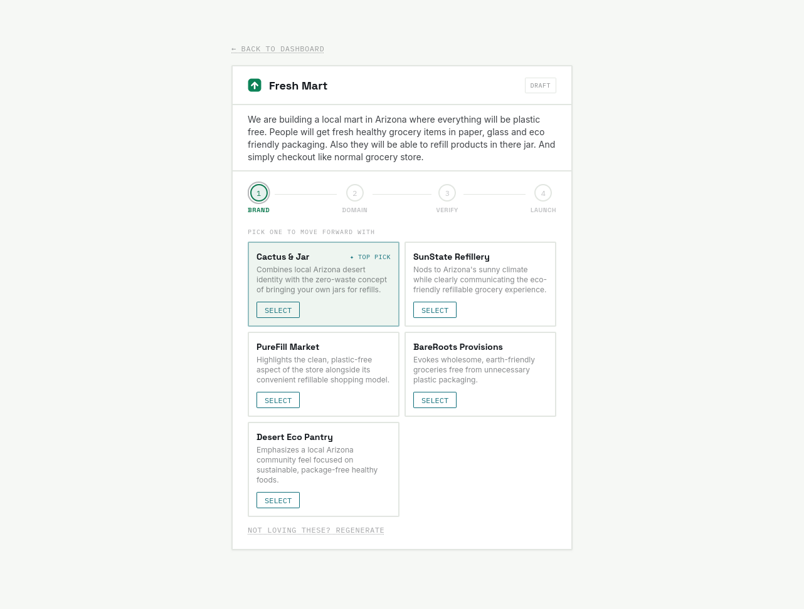
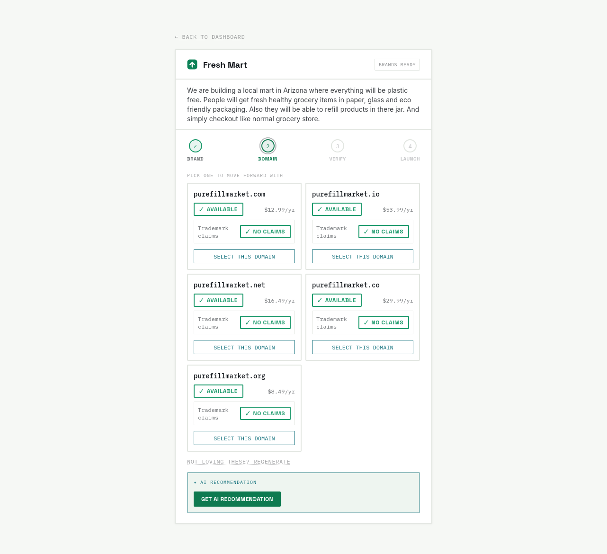
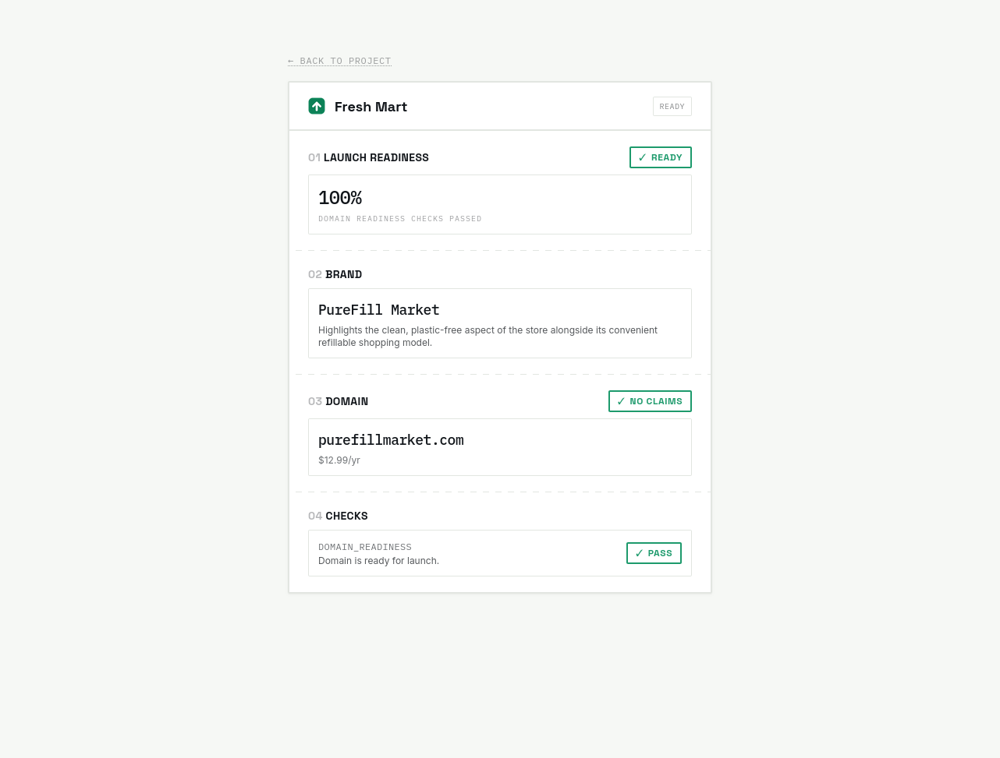
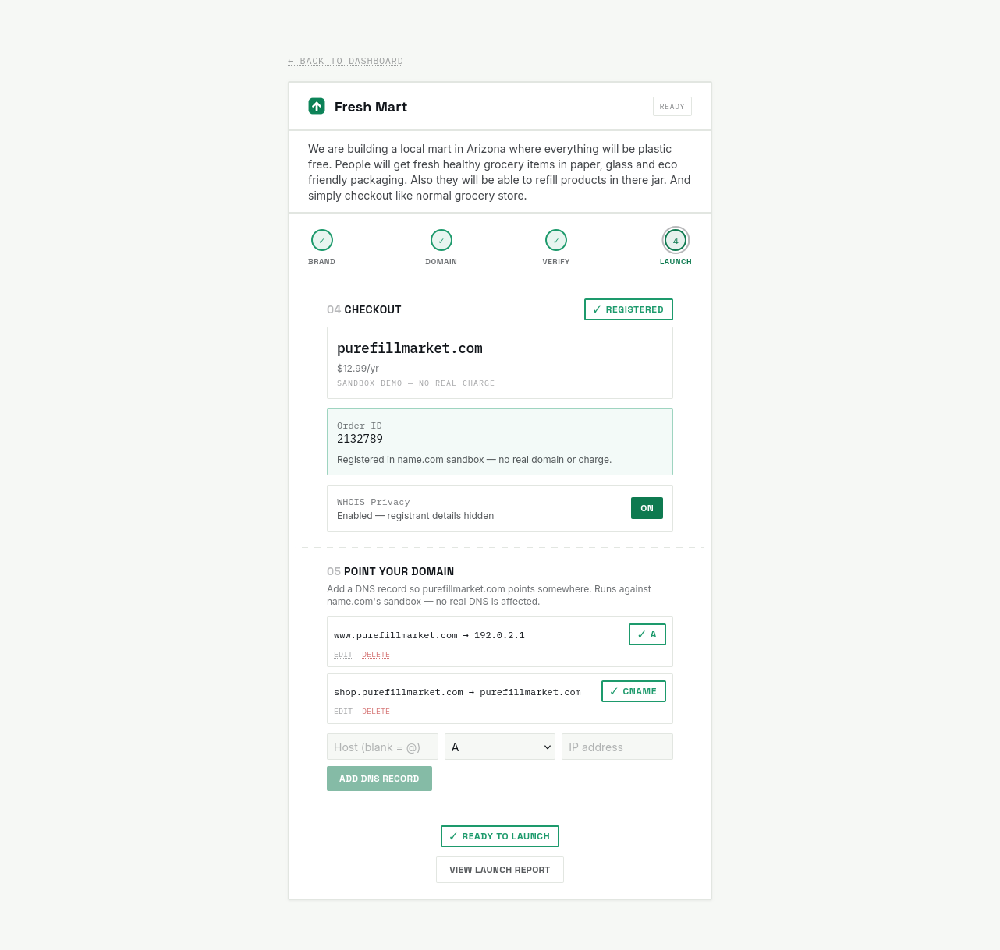

# Domain Launch Assistant

Turn a business idea into a launch-ready domain in one flow: AI brand names → real name.com availability & pricing → AI pick → trademark check → DNS readiness → sandbox registration.

Every founder hits the same wall on day one. What do I even call this thing, and can I actually get the domain for it? That question normally sends you bouncing between an AI naming tool, a domain registrar, and a DNS dashboard, three separate tools for one decision. This collapses all of that into a single guided workflow.

**Live demo:** [dla.areebahassan.xyz](https://dla.areebahassan.xyz/)
**Devpost submission:** [your-devpost-link-here](https://devpost.com/software/domain-launch-assistant)
**Video walkthrough:** [your-youtube-link-here](https://youtube.com/your-link)

---

## What it does

You describe your business in plain language, and the app:

- Generates brandable names via Gemini, with reasoning behind each
- Checks real-time availability and live pricing against name.com across founder-chosen extensions (`.com`, `.ai`, `.io`, `.net`, `.org`, `.co`, `.dev`, `.app`)
- Surfaces an AI-recommended pick among available domains, with reasoning
- Runs an automatic trademark (TMCH) claims check on every available candidate
- Verifies DNS resolution readiness
- Walks through a sandboxed domain registration (real name.com Create Domain call, sandbox-scoped) with a WHOIS privacy toggle
- Configures A and CNAME DNS records against the now-registered sandbox domain, with full create/edit/delete
- Produces a launch report summarizing the whole journey

Auth is JWT-based, with Google Sign-In as an alternate entry point — an account is created automatically on first Google login, no separate registration step needed.

---

## Screenshots

### Login


### Dashboard


### AI Brand Generation


### Domain Search & Trademark Check


### Launch Readiness


### Checkout & DNS Configuration


---

## How it's built

**Backend:** Django (API-only, DRF), split into apps by responsibility — `accounts`, `launches`, `brands`, `domains`, `dns`, `tasks`, `core`. Anything provider-dependent (Gemini, name.com) runs through Celery; the frontend polls a task-status endpoint instead of blocking on slow external calls. Postgres holds all workflow state; name.com stays the source of truth for live DNS records — nothing is cached locally.

**name.com integration:** two fully separate client instances — production credentials for search/pricing/claims, sandbox credentials (host-guarded, not just a settings flag) for registration and DNS record management. A "sandbox" action can't accidentally hit a real, billable endpoint.

**Frontend:** React + Tailwind, talking to Django exclusively over versioned JSON (`/api/v1/`). No provider credentials or business logic on the frontend.

### Tech stack

Django · Django REST Framework · PostgreSQL · Redis · Celery · React · Tailwind CSS · Gemini API · name.com API · Docker · Nginx · Gunicorn · JWT (SimpleJWT) · Oracle Cloud · GitHub Actions

---

## Challenges we ran into

- **Google Sign-In on mobile** — the initial approach rendered Google's real widget invisibly and proxied clicks to it via JS. Works on desktop, but mobile browsers require a genuinely trusted user gesture to open the OAuth flow, so a JS-dispatched `.click()` silently did nothing. Fixed by rendering the real widget as a transparent overlay directly on top of the styled button.
- **Never confusing a failed call with a real result** — a name.com timeout must never be recorded as "domain taken" or "no trademark claims." It has to surface as an explicit failure state, never a false negative.
- **Keeping sandbox and production traffic structurally separate** — solved with a runtime host-guard, not just separate settings variables.

---

## What's next

- Real (non-sandbox) domain registration and billing
- General-purpose DNS management beyond A/CNAME (MX/TXT/SRV already supported server-side, not yet exposed in the UI)
- Caching for repeat availability lookups (Redis is already wired as the Celery broker, just not used for caching yet)
- A country-aware business registration handoff — once a founder locks in a domain, route them toward forming the actual legal entity (e.g. an LLC) via referral partnerships with business-formation platforms, tailored to their country

---

## Running locally

```bash
git clone git@github.com:reehassan/domain_launch_assistant.git
cd domain_launch_assistant

# copy env template and fill in your own keys (Gemini, name.com sandbox, etc.)
cp .env.example .env

docker compose up --build
```

Backend runs at `http://localhost:8000`, frontend at `http://localhost:5173` (adjust to your actual `docker-compose.yml` ports).

> **Note:** never commit a real `.env` file. Double-check `git log --all --full-history -- .env` is clean before pushing this repo public.

---

## License

See [LICENSE](./LICENSE).
